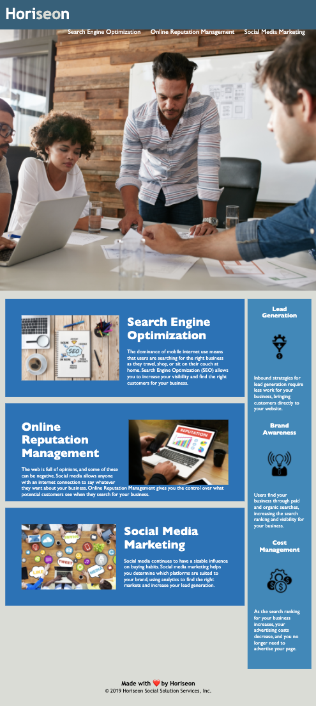

# Horiseon: Online Managment.

Website: Horiseon: Online Managment

This is a project I did with starting code for the University of Denver Coding Bootcamp.

The project was as follows: 
As a marketing agency
I want a codebase that follows accessibility standards
so that our own site is optimized for search engines.

My assignment criteria was as follows:
Given a webpage meets accessibility standards
When I view the source code
Then I find semantic HTML elements
When I view the structure of the HTML elements
Then I find that the elements follow a logical structure independent of styling and positioning
When I view the icon and image elements
Then I find accessible alt attributes
When I view the heading attributes
Then they fall in sequential order
When I view the title element
Then I find a concise, descriptive title

Changes: Changes to the code are commented within the HTML and CSS files.

The following image shows the webpage's appearance:

